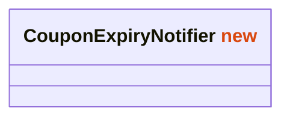
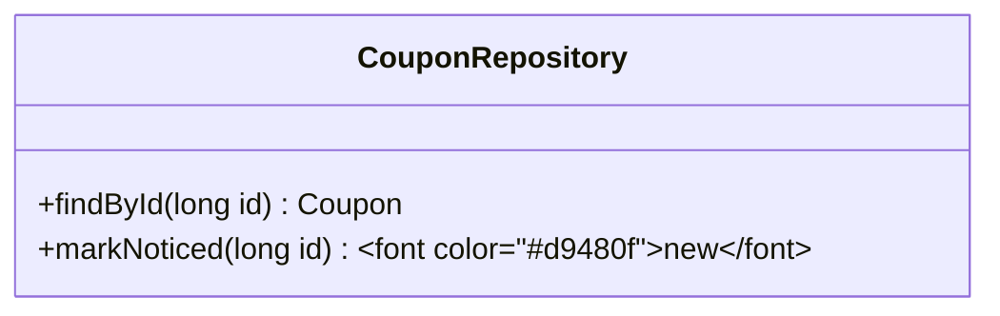
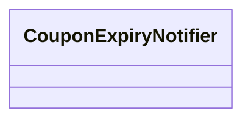
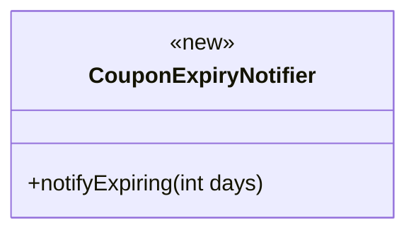
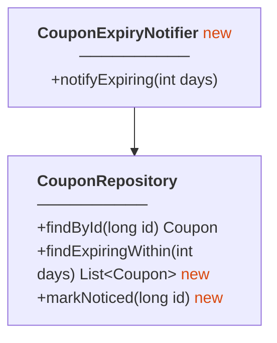

### a. 클래스 라벨에 font 태그

```mermaid
classDiagram
  class Notifier["CouponExpiryNotifier <font color='#d9480f'>new</font>"]
```

### b. 메서드 줄에 font 태그

```mermaid
classDiagram
  class CouponRepository {
    +findById(long id) Coupon
    +markNoticed(long id) <font color='#d9480f'>new</font>
  }
```

### c. cssClass + classDef

```mermaid
classDiagram
  class CouponExpiryNotifier
  classDef added color:#d9480f
  cssClass "CouponExpiryNotifier" added
```

### d. 스테레오타입

```mermaid
classDiagram
  class CouponExpiryNotifier {
    <<new>>
    +notifyExpiring(int days)
  }
```

### e. 흐름도 노드로 그린 클래스

```mermaid
flowchart TB
  R["<b>CouponRepository</b><br/>──────────<br/>+findById(long id) Coupon<br/>+findExpiringWithin(int days) List&lt;Coupon&gt; <span style='color:#d9480f'>new</span><br/>+markNoticed(long id) <span style='color:#d9480f'>new</span>"]
  N["<b>CouponExpiryNotifier</b> <span style='color:#d9480f'>new</span><br/>──────────<br/>+notifyExpiring(int days)"]
  N --> R
  style R text-align:left
```
