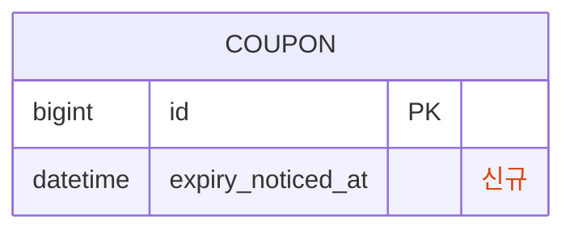
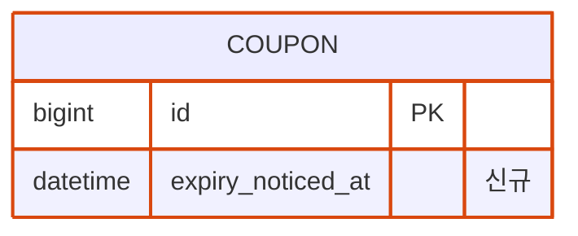
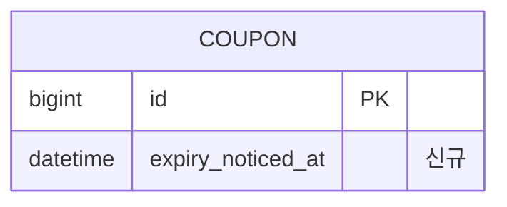

### a. 주석 칸 HTML span


### b. 컬럼명 자리에 HTML
```mermaid
erDiagram
  COUPON {
    bigint id PK
    datetime <span_style='color:#d9480f'>expiry_noticed_at</span> "신규"
  }
```

### c. 테두리만 (글자색 없음)


### d. 컬럼 글자색 CSS 선택자 시도 (themeCSS)


### e. themeCSS 로 특정 행 글자색 (nth-child)

