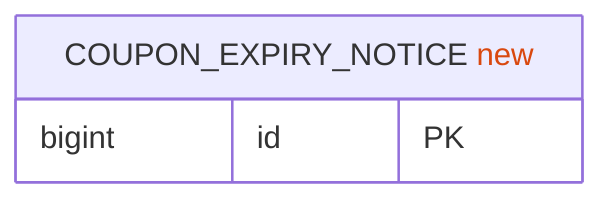
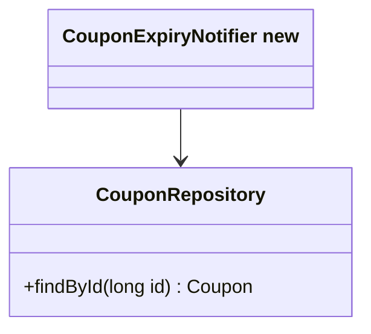
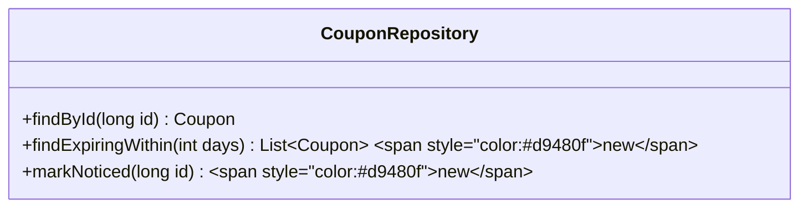
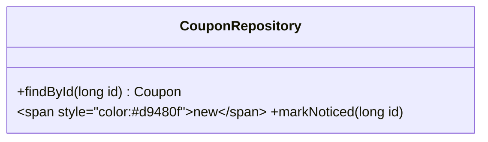

### a. ERD 엔티티 별칭에 HTML

```mermaid
erDiagram
  NOTICE["COUPON_EXPIRY_NOTICE <span style='color:#d9480f'>new</span>"] {
    bigint id PK
  }
```

### b. 클래스 라벨에 HTML

```mermaid
classDiagram
  class Notifier["CouponExpiryNotifier <span style='color:#d9480f'>new</span>"]
  class Repo["CouponRepository"] {
    +findById(long id) Coupon
  }
  Notifier --> Repo
```

### c. 클래스 메서드 뒤에 HTML

```mermaid
classDiagram
  class CouponRepository {
    +findById(long id) Coupon
    +findExpiringWithin(int days) List~Coupon~ <span style='color:#d9480f'>new</span>
    +markNoticed(long id) <span style='color:#d9480f'>new</span>
  }
```

### d. 클래스 메서드 앞에 HTML

```mermaid
classDiagram
  class CouponRepository {
    +findById(long id) Coupon
    <span style='color:#d9480f'>new</span> +markNoticed(long id)
  }
```
