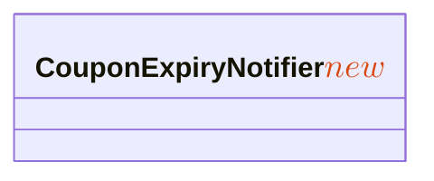
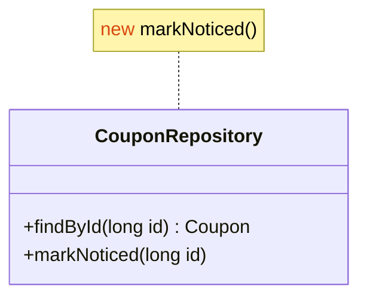
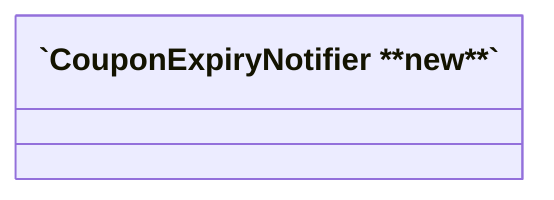

### e. 클래스 라벨에 KaTeX


### f. 클래스 메서드에 KaTeX
```mermaid
classDiagram
  class CouponRepository {
    +findById(long id) Coupon
    +markNoticed(long id) $$\color{#d9480f}{new}$$
  }
```

### g. 클래스 note에 HTML


### h. 클래스 라벨에 마크다운 문자열

