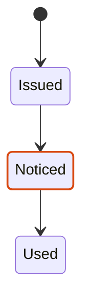
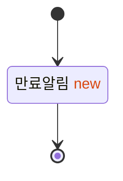

### a. 새 상태 classDef + 새 전이 라벨 HTML
```mermaid
stateDiagram-v2
  [*] --> 발급
  발급 --> 사용: use()
  발급 --> 만료알림: notifyExpiring() <span style='color:#d9480f'>new</span>
  만료알림 --> 사용: use()
  만료알림 --> 만료: expire()
  발급 --> 만료: expire()
  사용 --> [*]
  만료 --> [*]
  classDef added stroke:#d9480f,stroke-width:2px
  classDef base stroke:#1a1a17
  class 만료알림 added
  class 발급,사용,만료 base
```

### b. ::: 문법


### c. 상태 라벨에 HTML

