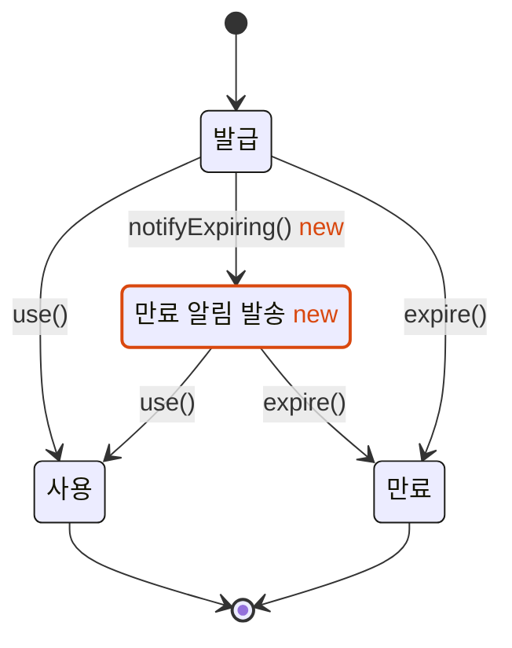

### a. 영문 ID + 한글 별칭, 새 상태 classDef, 새 전이 라벨 HTML

```mermaid
stateDiagram-v2
  state "발급" as Issued
  state "사용" as Used
  state "만료 알림 발송 <font color='#d9480f'>new</font>" as Noticed
  state "만료" as Expired
  [*] --> Issued
  Issued --> Used: use()
  Issued --> Noticed: notifyExpiring() <span style='color:#d9480f'>new</span>
  Noticed --> Used: use()
  Noticed --> Expired: expire()
  Issued --> Expired: expire()
  Used --> [*]
  Expired --> [*]
  classDef added stroke:#d9480f,stroke-width:2px
  classDef plain stroke:#1a1a17
  class Noticed added
  class Issued, Used, Expired plain
```
