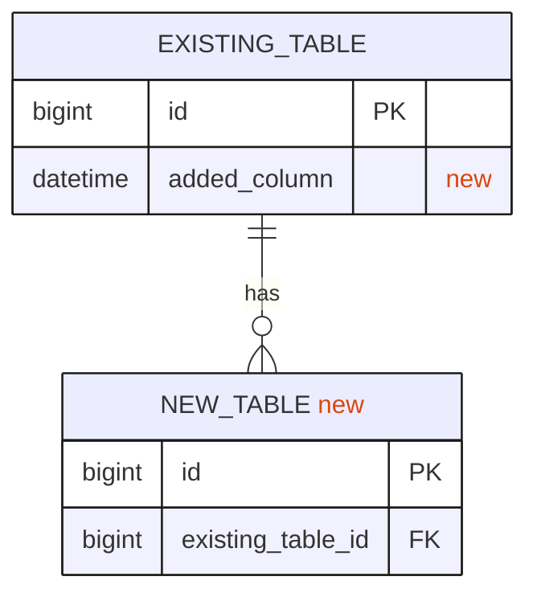
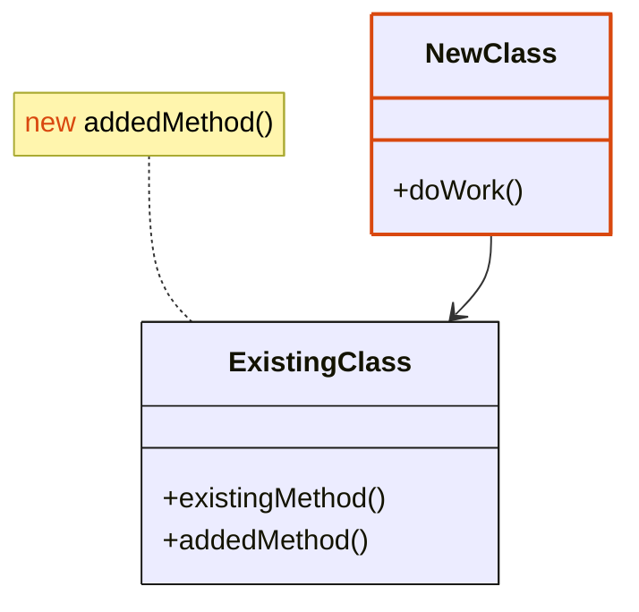
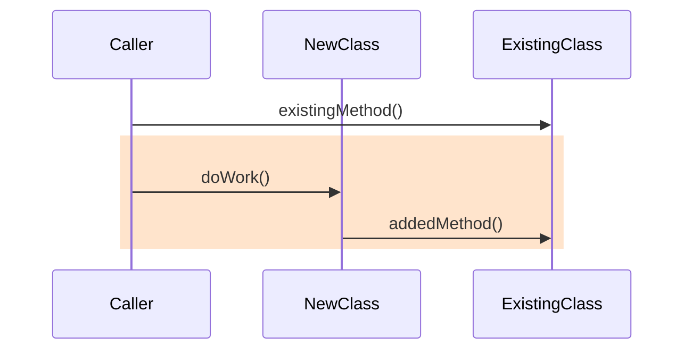
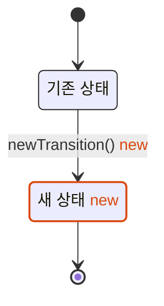

<!--
개발 저장소 플랜 PR(플랜 → 통합 브랜치) 본문 템플릿. 규격은 `branching` 규약의 "개발 저장소 플랜 PR 본문" 절이다.
내용이 없는 절은 지운다. 바꾼 것이 없는 다이어그램 종류는 그리지 않는다.
표시: 추가한 것은 빨간 new, 새로 만든 것은 빨간 테두리(#d9480f), 기존 것의 테두리는 #1a1a17.
-->
플랜 문서: `{스펙 저장소 플랜 폴더 경로}/plan.md`

## 설계

빨간 new는 이번 플랜에서 추가한 것이고, 빨간 테두리는 새로 만든 것입니다.

### 데이터 모델

### 클래스 구성

### 처리 흐름

### 상태 전이

## 태스크 PR

- T1 — {태스크 제목} #{PR 번호}

## 리뷰어가 확인할 것

- {권한 있는 사람이 확인해야 넘어가는 것}

## 이 PR에서 뺀 것

- {뺀 것} — {어디서 하는지}

## 티켓

- 에픽: {에픽 키}
- 스펙: {스펙 티켓 키}
- 플랜: {플랜 티켓 키}
